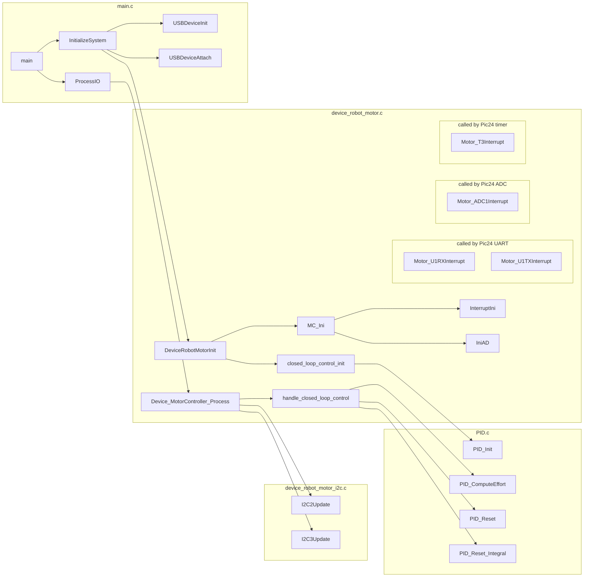

Firmware
========

## Installation

Released hex files can be found at https://github.com/RoverRobotics/OpenRoverFirmware-dan/releases and may be deployed with the PICkit3 standalone programmer application.

### Deployment instructions with PICkit3 standalone

If you are not using MPLAB IDE, you can deploy a hex file with the standalone [PICkit 3 Programmer Application v3.10](http://ww1.microchip.com/downloads/en/DeviceDoc/PICkit3%20Programmer%20Application%20v3.10.zip).

1. If the program says "The PICkit 3 has no Operating System" browse to select an OS hex file for PicKit3. Mine is at `C:\Program Files (x86)\Microchip\PICkit 3 v3\PK3OSV020005.hex`
2. File -> Import Hex -> (choose hex file)
3. Click the Write button

If you want to use MPLAB afterwards, go to Tools -> Revert to MPLAB mode

## Release Notes

(:sunny: = feature, :umbrella: = bugfix, :snowflake: = nonfunctional change)

### unreleased

* :snowflake: Delete even more unused code (robot accessories, controllers)
* :snowflake: Lots of documentation improvements

### 1.2.1

* :umbrella: Re-enable motor control over UART, which were broken due to a 1.2.0 firmware bug
* :snowflake: unify I<sup>2</sup>C code under a single API


### 1.2.0

* :sunny: Add Battery Status, Mode, Temp for both batteries to data driver can request over UART
* :snowflake: Delete much unused code, reorganize existing code
* :snowflake: Add coding standards, readme

### 1.0.3
* :snowflake: No functional changes. This is identical to the Robotex Firmware.

## Development

The MCP files can be opened in [MPLAB IDE v8.92](http://ww1.microchip.com/downloads/en/DeviceDoc/MPLAB_IDE_8_92.zip) (not MPLAB X) and should be built with the  [MIcrochip C30 Toolsuite v3.31](http://ww1.microchip.com/downloads/en/DeviceDoc/mplabc30-v3_31-windows-installer.exe). This contains not only a compiler/linker/assembler but also standard libraries for the PIC24F MCU's.

To build, use the Debug mode (if you're attaching a PICKit) or Release mode (if you're using this with other things). Note that if you build in Debug mode and you hit a breakpoint (`BREAKPOINT()` macro), execution will halt and wait for the debugger. If no debugger is attached, the [Watchdog Timer](http://ww1.microchip.com/downloads/en/devicedoc/39697a.pdf) will restart the device.

To tidy up code, I like using **[clang-format 6](http://releases.llvm.org/6.0.1/tools/clang/docs/ClangFormat.html)**, and have provided a .clang-format file. Clang 6 is currently the latest release for Ubuntu, but feel free to use newer. Ubuntu installation:

```bash
sudo apt install clang-format-6.0
sudo ln -s `which clang-format-6.0` /usr/local/bin/clang-format
```
Before committing, please run:

```bash
git diff --name-only --cached --relative --diff-filter=d -- '*.h' '*.c' | xargs clang-format -style=file -i
```
This will tidy up all locally modified files. You can make this a precommit hook if you like.

Code tips for debuggability as of MPLAB v8.92:

* Typedef'd types should have a name anyway. It looks redundant, but the debugger will display the value as an enum instead of an int without that first "my_enum".

  ```C
  typedef my_enum1 {\*...*\} my_enum1; //< Don't do this
  typedef enum my_enum2 {\*...*\} my_enum2; //< Do this instead
  ```

* Similarly, if you have a magic size array, declare the size as a defined value, not a constant. Otherwise, the debugger will show the array as an opaque pointer instead of as an array.

  ```c
  static const SIZE = 10; //< Don't do this
  #define SIZE 10; //< Do this instead
  unsigned int my_array[SIZE];
  ```

### Deployment instructions with MPLAB

Given a released hex file, you can deploy to the robot power board with MPLAB instead of the PICKit3 standalone tool.

1. File -> Import... -> (choose hex file)
2. Programmer -> Select Programmer -> PICKit 3
3. (Only needed if the target rover has no battery. If it has a power source, this step will fail) Programmer -> Settings -> Power tab -> Power Target circuit from PICKit3 -> OK
4. Programmer -> Program

## Power Board Firmware Development

The main robot firmware code is the Power Board. This is responsible for communicating with the motors / batteries / fans / serial port.

```
$ cd /mnt/c/Users/dan/Documents/OpenRoverFirmware-dan/Power_Board#
$ tree -h
.
├── [3.1K]  CMakeLists.txt
├── [ 512]  cmake-build-debug
├── [ 512]  doc
│   ├── [106K]  2011Arm_Base_Datasheet.doc
│   ├── [107K]  2011Arm_Link1_Datasheet.doc
│   ├── [ 17K]  2011Robot_PowerBoard_AssistantCalculationSheet.xlsx
│   ├── [ 31K]  2011_Robot_PowerBoard200_Evaluation_Datasheet.docx
│   ├── [ 63K]  2011_Robot_PowerBoardDatasheet.docx
│   └── [  62]  XbeeModuleConfiguration.txt
├── [5.4K]  firmware.mcp
├── [ 512]  include
│   ├── [1.5K]  Filters.h
│   ├── [1.1K]  HardwareProfile.h
│   ├── [2.9K]  InputCapture.h
│   ├── [3.5K]  PID.h
│   ├── [8.6K]  device_robot_motor.h
│   ├── [ 234]  device_robot_motor_i2c.h
│   ├── [ 242]  device_robot_motor_loop.h
│   ├── [5.7K]  i2clib.h
│   ├── [ 812]  interrupt_switch.h
│   ├── [ 16K]  registers.h
│   ├── [1.3K]  stdhdr.h
│   ├── [  56]  testing.h
│   ├── [ 726]  uart_control.h
│   └── [3.3K]  usb_config.h
├── [ 512]  microchip
│   ├── [5.7K]  Compiler.h
│   ├── [5.3K]  DEE Emulation 16-bit.h
│   ├── [ 512]  USB
│   │   ├── [5.9K]  usb.h
│   │   ├── [ 28K]  usb_ch9.h
│   │   ├── [ 23K]  usb_common.h
│   │   ├── [ 47K]  usb_device.h
│   │   ├── [8.3K]  usb_function_audio.h
│   │   ├── [6.1K]  usb_function_ccid.h
│   │   ├── [ 22K]  usb_function_cdc.h
│   │   ├── [8.9K]  usb_function_generic.h
│   │   ├── [ 12K]  usb_function_hid.h
│   │   ├── [4.6K]  usb_function_midi.h
│   │   ├── [ 20K]  usb_function_msd.h
│   │   ├── [ 22K]  usb_hal.h
│   │   ├── [ 17K]  usb_hal_pic18.h
│   │   ├── [ 17K]  usb_hal_pic24.h
│   │   ├── [ 15K]  usb_hal_pic32.h
│   │   ├── [ 56K]  usb_host.h
│   │   ├── [ 24K]  usb_host_audio_v1.h
│   │   ├── [ 31K]  usb_host_cdc.h
│   │   ├── [8.7K]  usb_host_cdc_interface.h
│   │   ├── [ 11K]  usb_host_charger.h
│   │   ├── [ 23K]  usb_host_generic.h
│   │   ├── [ 32K]  usb_host_hid.h
│   │   ├── [ 24K]  usb_host_hid_parser.h
│   │   ├── [ 21K]  usb_host_msd.h
│   │   ├── [ 14K]  usb_host_msd_scsi.h
│   │   ├── [105K]  usb_host_printer.h
│   │   ├── [ 16K]  usb_host_printer_esc_pos.h
│   │   ├── [ 11K]  usb_host_printer_pcl_5.h
│   │   ├── [8.7K]  usb_host_printer_postscript.h
│   │   ├── [7.3K]  usb_host_printer_primitives.h
│   │   ├── [ 22K]  usb_otg.h
│   │   ├── [6.0K]  usb_printer_pos_bixolon_srp_270.h
│   │   ├── [5.8K]  usb_printer_pos_epson_tm_t88iv.h
│   │   ├── [5.9K]  usb_printer_pos_seiko_dpu_v445.h
│   │   └── [5.8K]  usb_printer_pos_seiko_mpu_l465.h
│   └── [7.4K]  uart2.h
└── [ 512]  src
    ├── [ 25K]  DEE Emulation 16-bit.c
    ├── [ 831]  Filters.c
    ├── [2.6K]  Flash Operations.s
    ├── [7.4K]  InputCapture.c
    ├── [3.7K]  PID.c
    ├── [ 43K]  device_robot_motor.c
    ├── [7.3K]  device_robot_motor_i2c.c
    ├── [7.9K]  device_robot_motor_loop.c
    ├── [ 17K]  i2clib.c
    ├── [2.6K]  interrupt_switch.c
    ├── [8.7K]  main.c
    ├── [1.1K]  stdfunctions.c
    ├── [   0]  testing.c
    ├── [7.9K]  uart_control.c
    ├── [1.2K]  usb_config.c
    ├── [3.8K]  usb_descriptors.c
    └── [ 97K]  usb_device.c

6 directories, 77 files
```

firmware.mcp = main project file. Open this with MPLab IDE v8.89

### Call Diagram of Important functions



```flow
# render with flowchart.js
# Typora will render this inline
st=>start: Start
BatVolChecking Timer enabled
BatRecovery Timer disabled
SpeedUpdate Timer depends on motor commands
op=>operation: Wait for 1ms timer tick
Increment enabled timers
batvolchecking=>condition: Is BATVolChecking Timer elapsed?
c3a=>operation: Increment Overcurrent Counter
hicurrent=>condition: Is either battery current high (>512)?
hicurrent_yes=>operation: Increment Overcurrent Counter
locurrent=>condition: Is either battery current low (<341)?
locurrent_yes=>operation: Reset Overcurrent Counter to 0
long_overcurrent=>condition: Is Overcurrent Counter > 10?
long_overcurrent_yes=>operation: Set duty to all motors to 0
Set Overcurrent Flag
Start BATRecoveryTimer
bat_recovery=>condition: is BatRecovery Timer expired?
bat_recovery_yes=>operation: Clear OverCurrent flag
Disable the battery recovery timer
motor_speeds=>condition: Is SpeedUpdate Timer expired? (for each motor)
update_speed_oc=>condition: Is Overcurrent Flag set?
update_speed_oc_yes=>operation: set duty cycle to 0
update_speed_oc_no=>operation: set duty cycle to commanded speed
cond=>condition: Yes or No?
etc=>subroutine: more main loop stuff
todo=>end: Todo...

st->op->batvolchecking
hicurrent(yes)->hicurrent_yes
hicurrent_yes->long_overcurrent
long_overcurrent(yes)->long_overcurrent_yes->bat_recovery
long_overcurrent(no)->bat_recovery
batvolchecking(yes)->hicurrent
batvolchecking(no)->bat_recovery
hicurrent(no)->locurrent
locurrent(yes)->locurrent_yes->bat_recovery
locurrent(no)->bat_recovery
bat_recovery(yes)->bat_recovery_yes->motor_speeds
bat_recovery(no)->motor_speeds
motor_speeds(yes)->update_speed_oc
update_speed_oc(yes)->update_speed_oc_yes->etc
update_speed_oc(no)->update_speed_oc_no->etc
motor_speeds(no)->etc
etc->op
```


### registers.h

This file contains metadata about global variables which are used to communicate to and from the robot. Though not truly CPU registers, we call them registers anyway. e.g.:

​	`REGISTER( REG_ROBOT_REL_SOC_A, DEVICE_READ,  DEVICE_MOTOR, SYNC, int16_t )`

- `REG_ROBOT_REL_SOC_A` = name of global variable holding this value
- `DEVICE_READ` = the firmware will read this value from hardware.
- `DEVICE_MOTOR` = [DEFUNCT]
- `SYNC` = [DEFUNCT]
- `uint16_t` = datatype of variable holding this value

Note that the REGISTER macro is *not* defined in this file. It is defined externally and then this file is imported.

usb_config.c declares a global variable per register to hold the physical data. It also defines an array (`struct REGISTER registers[]`) that makes register metadata available at runtime (except for the datatype).

At this time, the only code that uses register metadata is `main.c::ProcessIO`, which reads/writes registers based on their index in `registers[]`, i.e. their order in `registers.h`

```c
// usb_config.h
struct REGISTER
{
   SIZE     size;
   SYNC_BIT sync;
   DEVICE   device;
   RW       rw;
   DATA_PTR ptr;
};

extern struct REGISTER registers[];
#define REGISTER( a, b, c, d, e)       extern e a __attribute__((VAR_ATTRIBS));
#include "registers.h"

// usb_config.c

#define REGISTER( a, b, c, d, e )    e a;
//...
#include "registers.h"
//...
#undef  REGISTER
//...

#define REGISTER_START()            struct REGISTER registers[] = { 
#define REGISTER( a, b, c, d, e )                                   {sizeof(e),d,c,b,&a},
#define REGISTER_END()                                              {0} };
//...
#include "registers.h"
```


### device_robot_motor.c

Weighing in at 3662 lines, this file is a scary mess.

#### Motor_ADC1Interrupt

Periodically, the hardware [A/D Converter module](http://ww1.microchip.com/downloads/en/DeviceDoc/39705b.pdf)  calls the interrupt function `Motor_ADC1Interrupt` to get incoming analog signals:

- ADC1BUF4 = AN4 = Flipper Motor position 1 (?)
- ADC1BUF5 = AN5 = Flipper Motor position 2 (?)
- ADC1BUF3 = Left Motor Current
- ADC1BUF1 = Right Motor Current
- ADC1BUFB = Flipper Motor Current
- ADC1BUF6 = Battery Voltage A
- ADC1BUF7 = Battery Voltage B

These values are all stored in rolling buffers of 4 values, whose values are not directly used but their averages are.

This function also populates the data buffers for UART communication.

#### Motor_U1TXInterrupt / Motor_U1RXInterrupt

These functions are called by the hardware [UART module](http://ww1.microchip.com/downloads/en/DeviceDoc/en026583.pdf) as transmit (TX) and receive (RX) interrupts. The logic to actually populate the data to be transmitted is in `Motor_ADC1Interrupt`, but it should not be.

This function takes the incoming two bytes, and treats the first one as a command instruction, and the second as a command argument.

Command Instructions:

```c
#define P1_Read_Register 10
#define P1_Fan_Command 20
#define P1_Low_Speed_Set 240
#define P1_Calibration_Flipper 250
```

The command argument for P1_Read_Register is which register to read. This is not the index in `registers[]`, but is hardcoded into a long switch statement.

P1_Fan_Command: Set the side fan speed to the value of the command argument.

P1_Low_Speed_Set: Set low speed mode variable. Expected value 0 or 1. This has the same effect as setting `REG_MOTOR_SLOW_SPEED=1`

P1_Calibration_Flipper: command argument is ignored. Sets `Xbee_Calibration` flag, which causes `calibrate_flipper_angle_sensor` to be called.

UpdateSpeed is where this commands the robot motors to change speeds.

The main loop for gathering data from hardware is in `Device_MotorController_Process`,  where it calls `I2C2Update` and `I2C3Update`.

### device_robot_motor_i2c.c

I2C2Update and I2C3Update functions query devices on two separate I2C buses and are both asynchronous, doing work and waiting for the device to respond. Communication with I2C is very similar to SMBus, so to start understanding what's going on, see http://smbus.org/specs/SMBus_3_0_20141220.pdf.

I2C2Update:

- Fan controller:
  - Get left fan temperature
  - Get right fan temperature
  - Set fan speed
- Battery A:
  - Get state of charge (% full)
  - Get battery status
  - Get battery mode
  - Get temperature

I2C3Update:

- Battery Charger:
  - read charger state (is charging or not)
- Battery B:
  - Get state of charge (% full)
  - Get battery status
  - Get battery mode
  - Get temperature

